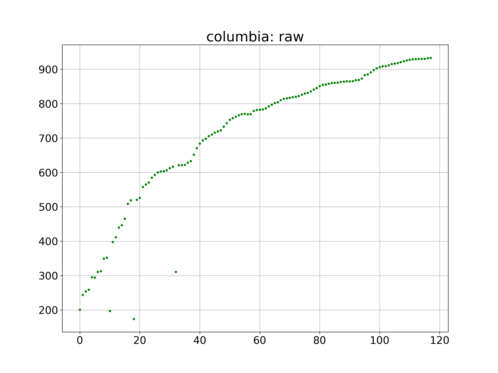
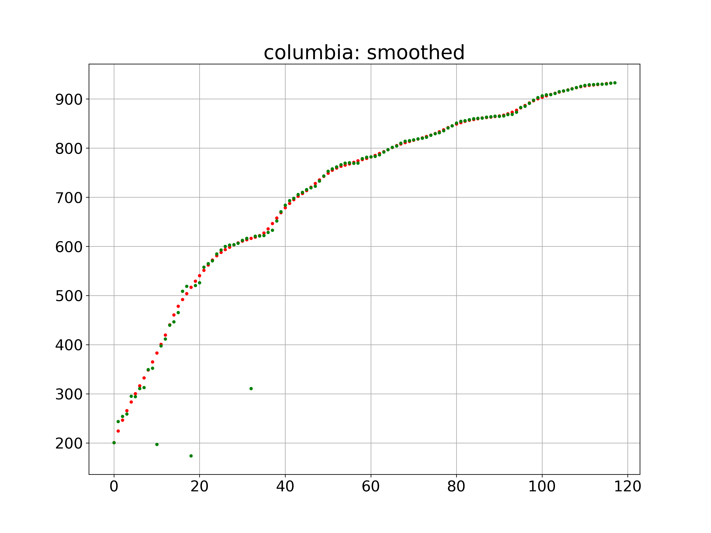
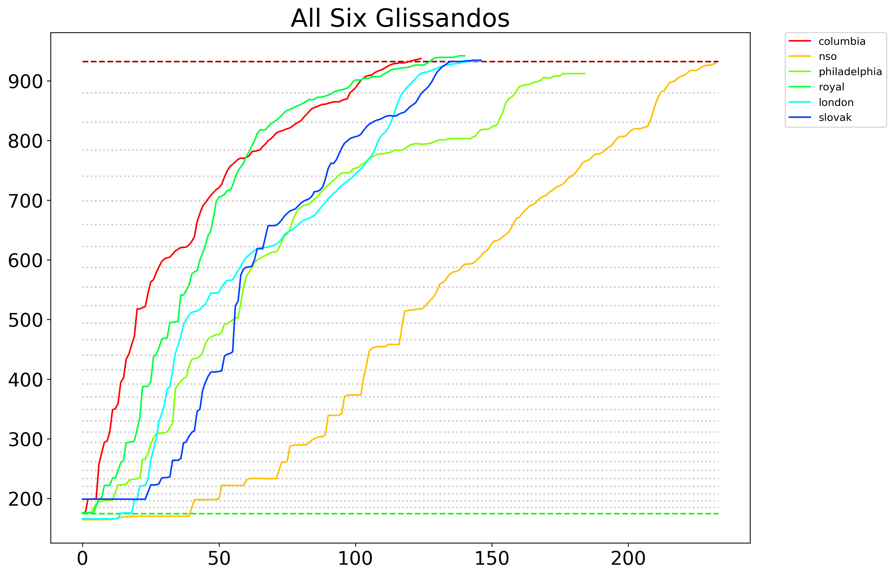

# Plotting Gershwin

Using pitch detection to graph the opening glissando in "Rhapsody in Blue"

## Background 
George Gershwin's _Rhapsody in Blue_, which debuted in 1924, famously beginnings with a clarinet trill that launches into a [glissando](https://en.wikipedia.org/wiki/Glissando) in which the clarinets bends the pitch all the way from a low B$flat; to a high B&flat;, spanning two octaves in a continuous pitch. It's up to the clarinetist how she wants to get there--in technical terms, she chooses which easing function to apply to the tween. These scripts plot five different versions to visualize how different players attack this challenge.

## Setup
You'll need Node and Python 3, which you can download directly or install via Homebrew. Then install the dependencies
	
	pip install -r requirements.txt #may require sudo or `pip3` depending on your setup
	npm install

## Performances

+ [Columbia Symphony Orchestra (Leonard Bernstein)](https://www.youtube.com/watch?v=9aS20ojHDHg)
+ [Philadelphia Orchestra](https://www.youtube.com/watch?v=xWB5m3ycYg0)
+ [Royal Philharmonic Orchestra](https://www.youtube.com/watch?v=hpynmrUI4oI)
+ [Slovak National Philharmonic Orchestra](https://www.youtube.com/watch?v=ynEOo28lsbc)
+ [London Symphony Orchestra](https://www.youtube.com/watch?v=ss2GFGMu198)

## Getting the clips

The [`get_audio.js`](get_audio.js) script downloads the YouTube url, extracts just the portion of the audio you specify, and deletes the downloaded videos

+ `node get_audio.js --name=columbia --url=https://www.youtube.com/watch?v=9aS20ojHDHg --start=3 --end=8`
+ `node get_audio.js --name=philadelphia --url=https://www.youtube.com/watch?v=xWB5m3ycYg0 --start=3 --end=9`
+ `node get_audio.js --name=royal --url=https://www.youtube.com/watch?v=hpynmrUI4oI --start=3 --end=8`
+ `node get_audio.js --name=slovak --url=https://www.youtube.com/watch?v=ynEOo28lsbc --start=5 --end=8`
+ `node get_audio.js --name=london --url=https://www.youtube.com/watch?v=ss2GFGMu198 --start=6 --end=12`

(I cleaned up each sample in Audacity to make sure it starts right at the beginning of the glissando and ends right before the rest of the orchestra joins in)

## Generating the frequencies

I would prefer to have used Node here, but the Python bindings to the [aubio toolkit](https://aubio.org/) have more sophisticated pitch detection than the leading [Node module](https://www.npmjs.com/package/node-pitchfinder), which is still working on implementing the "YIN w/ FFT" algorithm.

The Python script [`Generate_Frequencies.py`](Generate_Frequencies.py) detects the pitch at intervals of 1024 frames. The output is very good but inevitably contains some outliers. For example, here's the raw output for the Columbia Symphony Orchestra:

To correct for the noise, I wrote a simple algorithm to guess where the outliers ought to be. It's not perfect and arguably overfits some of the time, but it's reasonably consistent across the five samples:

	# first, identify all the outliers and move them closer to the correct position
	corrected = [pitches[0]]
	for i in range(1, len(pitches)-1):
	    diff = abs(pitches[i]-corrected[i-1]) / corrected[i-1]
	    # if there's a huge difference, match the previous note. Otherwise, take the average.
	    if diff > 0.4:
	        corrected += [corrected[i-1]]
	    elif diff > 0.25:
	        average = (corrected[i-1] + pitches[i+1]) / 2
	        corrected += [average]
	    else:
	        corrected += [pitches[i]]
	        
	# then iterate over the corrected array, gradually bringing the outliers into line
	for x in range(2,20):
	    arr = corrected
	    for i in range(1, len(arr)-1):
	        diff = abs(arr[i] - arr[i+1]) / arr[i+1]
	        threshold = 1 - 0.06 * x # the value of 0.06 was determined by pure trial-and-error. Raising causes overfitting
	        if diff > threshold:
	            average = (arr[i-1] + arr[i+1]) / 2
	            #print(x, i, threshold, arr[i], corrected[i-1], diff, average)
	            corrected[i] = average

Here's how it fixes up the Columbia output. The red dots are the corrected frequencies and the green dots are the original.

The Python script outputs three files: Two images in the [output/images](output/images) directory that graph the algorithm's raw output and smoothed output, and a csv file in the [output/data](output/data) directory that contains the smoothed frequency for each point.

Here are the command-line scripts for all five samples. (Again, depending on your system, you may need to run `python3`)

+ `python Generate_Frequencies.py --name=columbia --title="Columbia Symphony Orchestra"`
+ `python Generate_Frequencies.py --name=philadelphia --title="Philadelphia Orchestra"`
+ `python Generate_Frequencies.py --name=royal --title="Royal Philharmonic Orchestra"`
+ `python Generate_Frequencies.py --name=slovak --title="Slovak National Philharmonic Orchestra"`
+ `python Generate_Frequencies.py --name=london --title="London Symphony Orchestra"`

Let's compare them and see how they stack up!
	
	python Compare.py

This writes an image called `compare.png` to the [output/images](output/images) directory and, for the sake of convenience, writes a JSON files called [`glissandos.json`](output/data/glissandos.json) to the [output/data](output/data) directory.

## Generating waves from the data

To test if we did this right, we can generate `.wav` files from the outputted data:

	node make_wave.js --name=columbia

That outputs a file called `columbia.wav` to the [output/sounds](output/sounds) directory. 

