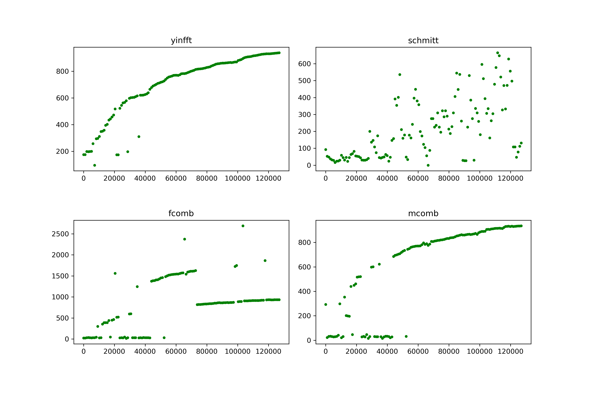
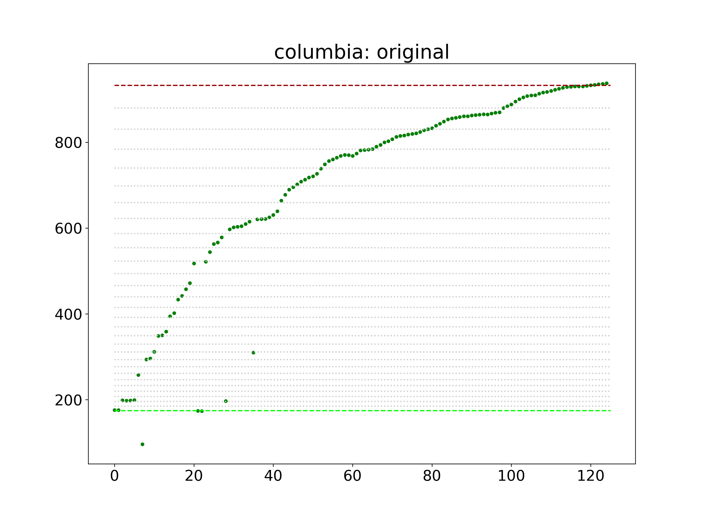
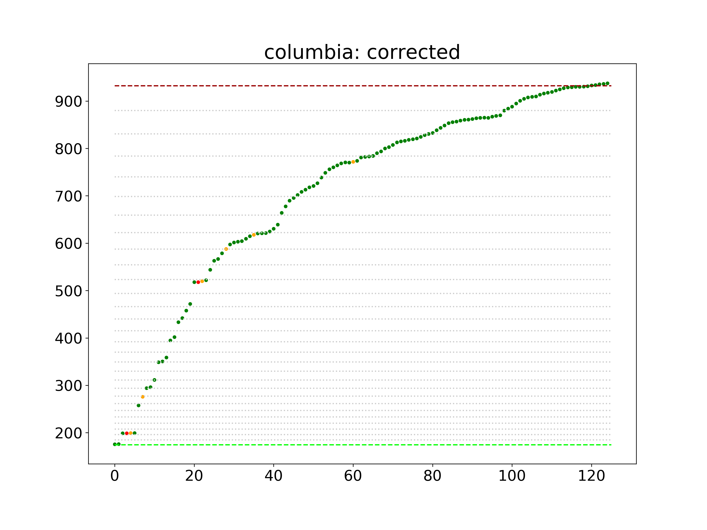

# Plotting Gershwin

Using pitch detection to graph the opening glissando in "Rhapsody in Blue"

## Background 
George Gershwin's _Rhapsody in Blue_, which debuted in 1924, famously beginnings with a clarinet trill that launches into a [glissando](https://en.wikipedia.org/wiki/Glissando) in which the clarinets bends the pitch all the way from the F below middle C on a piano to a high B&flat;, spanning two-and-a-half octaves in a continuous pitch. It's up to the clarinetist how she wants to get there&mdash;in animation terms, she chooses which [easing function](https://github.com/d3/d3-ease#_ease) to apply to the tween. These scripts plot six different versions to visualize how different players attack this challenge.

## Performances

Here are the complete performances on YouTube for six of my favorite examples:

+ [Columbia Symphony Orchestra (Leonard Bernstein)](https://www.youtube.com/watch?v=9aS20ojHDHg)
+ [National Symphony Orchestra (Jon Kimura Parker)](https://www.youtube.com/watch?v=HNkKjJY_ZRE)
+ [Philadelphia Orchestra](https://www.youtube.com/watch?v=xWB5m3ycYg0)
+ [Royal Philharmonic Orchestra](https://www.youtube.com/watch?v=U17-ZD4K4kI)
+ [Slovak National Philharmonic Orchestra](https://www.youtube.com/watch?v=ynEOo28lsbc)
+ [London Symphony Orchestra](https://www.youtube.com/watch?v=ss2GFGMu198)

## Getting and Adding Clips
I've already extracted just the glissandos from each performance, which you can find (and tinker with, if you desire) in the [samples](samples) directory. If you want to add any performances, just tack the YouTube URL and start and end times to [performances.json](performances.json). To download the clips, you'll need Node.js and [`ffmpeg`](https://www.ffmpeg.org/):

	npm install
	brew install ffmpeg # for Mac users

Then, assuming you added your clip to the JSON file correctly, just run:

	node getAudio --names=[name(s) of new performances in JSON file]

(For example, if you were to tinker with the `start_time` of the performance with the name `nso` and add one called `losangeles`, you'd run: `node getAudio --names=nso,losangeles`). Note that the `start_time` and `end_time` parameters are accurate down to 100ths of a second and may require some trial and error or zooming in with Audacity, though the Python script we'll be using does trim noise at the beginning. If you want to add a new clip, please add it to the JSON file and generate it with the script, not by hand.

## Setting up Python
While I'm a Node.js guy, this is a good example of where Python has more mature bindings to advanced algorithms&mdash;specifically, in this case, the [YIN algorithm](http://audition.ens.fr/adc/pdf/2002_JASA_YIN.pdf) with a [Fast Fourier transform](https://en.wikipedia.org/wiki/Fast_Fourier_transform), which Python's [aubio toolkit](https://aubio.org/) provides, but is still marked as "To Do" in the leading Node module, [node-pitchfinder](https://www.npmjs.com/package/node-pitchfinder).

To set up the Python virtual environment, it's best to [install Miniconda](https://docs.conda.io/en/latest/miniconda.html) and then run:

	conda env create --file environment.yml -n gershwin
	conda activate gershwin

This _should_ install the correct dependencies. I don't use `conda` very often so do let me know if you run into trouble. The dependencies are also in [`requirements.txt`].

The Python scripts are [Jupyter notebooks](https://jupyter.org/) in the [`notebooks`](notebooks) directly, which you can fire up with `jupyter notebook` or any Python editor of your choice.

## Generating the Frequencies
I know very little about pitch detection, but of the handful of pitch-detection algorithms supported by the [`aubio.pitch` function](https://aubio.org/manual/latest/py_analysis.html?highlight=pitch#aubio.pitch), here's a comparison of the output for the sample `columbia.wav`, which you can tinker with in [notebooks/Test_Pitch_Detection.ipynb](notebooks/Test_Pitch_Detection.ipynb):

It's pretty clear that `yinftt` (YIN with Fast Fourier) is the best bet. But none of these methods are going to produce a perfect glissando. Not only are harmonics complicated; sometimes someone in the front row coughs.

So I've written a fairly simple algorithm in [notebooks/Generate_Glissandos.ipynb](notebooks/Generate_Glissandos.ipynb) to rein in the outliers, under the premise that no frequency should be significantly lower than the preceding one. We'll be estimating the frequencies at a "hop size" of 1024, which, given the standard sampling frequency of 44100 Hz, comes out to 43 data points per second. Glissandos are typyically around 4 seconds long.

The Python script [`notebooks/Generate_Glissandos.ipynb`](notebooks/Generate_Glissandos.ipynb) starts with the YIN/FFT algorithm and both graphs the output, if you're using an interactive kernal like Jupyter, and writes the graph to `outputs/images/[name]_original.png`. Some initial results are better than others. For example, here's the raw output for the Columbia Symphony Orchestra:

To correct for the inevitable noise, the "correction" algorithm guesses where the outliers ought to be. It's not perfect and arguably overfits some of the time, but it's reasonably consistent across the six samples. Bear in mind that some clarinetists begin with a step-wise crawl before launching into the bend.

In short, the script uses a hyperparamter `THRESHOLD` to look for any pitch that's below the previous sample my more than a hair, than either averages that outlier with the following note, if the following note is higher than the preceding one, or just brings the outlier in line with the previous pitch:

	THRESHOLD = 0.001

	def correctPitches(pitches, name):
	    corrected = [ ( pitch, "green" ) for pitch in pitches ]

	    for i in range(1, len(corrected)):
	        current = corrected[i][0]
	        previous = corrected[i-1][0]
	        diff = (previous - current) / previous

	        if diff > THRESHOLD:
	            if (i < len(corrected) - 1 and (corrected[i+1][0] - previous) / previous > THRESHOLD):
	                average = (previous + corrected[i+1][0]) / 2
	                #print("averaging", i, current, corrected[i+1][0], previous, diff, average)
	                corrected[i] = ( average, "orange" )
	            else:
	                #print('moving up note at %s from %s to %s (%s)' % (i, current, previous, diff))                
	                corrected[i] = ( previous, "red" )

	    data_path = "../output/data/%s.csv" % name

	    with open(data_path, "w") as csvfile:
	        spamwriter = csv.writer(csvfile)
	        spamwriter.writerow(["freq"])    
	        spamwriter.writerows(map(lambda x: [x[0]], corrected))                        
	        print('Wrote corrected frequencies to ../output/data/%s.csv' % name)
	                
	    return corrected

Here's how it fixes up the Columbia output. The orange dots are the averaged corrections and the red ones are those that fall back to the previous sample.

The Python script outputs three files: Two images in the [output/images](output/images) directory that graph the algorithm's raw output and corrected output, and a csv file in the [output/data](output/data) directory that contains the smoothed frequency for each point.

At the end of the file, you'll see a loop to run through each sample. Now let's compare them and see how they stack up! You can load the `csv` files in [notebooks/Compare_Results.ipynb](notebooks/Compare_Results.ipynb).

This also writes an image called `comparison.png` to the [output/images](output/images) directory and, for the sake of convenience, writes a JSON files called [`glissandos.json`](output/data/glissandos.json) to the [output/data](output/data) directory.

## Optional: Generating Waves from the Data

To test if we did this right, we can generate `.wav` files from the outputted data:

	node makeWave.js --name=columbia

That examples outputs a file called `columbia.wav` to the [output/sounds](output/sounds) directory. **Warning: These do not sound attractive!** They won't shatter your glasses&mdash;the frequencies are identical&mdash;but they may irritate the cat.
